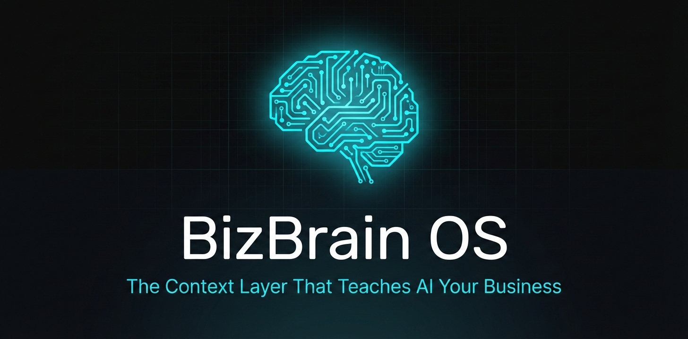
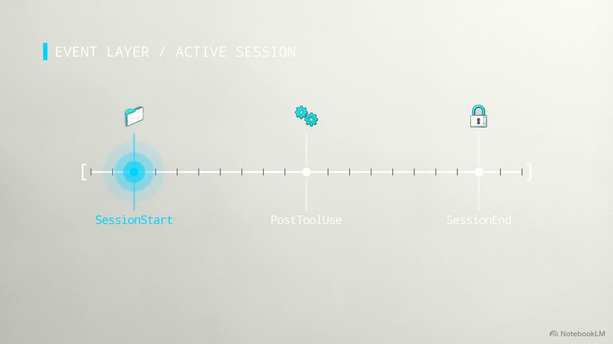

<div align="center">



# BizBrain OS

**AI-powered business brain. Persistent context that compounds across every session.**

[](https://github.com/TechIntegrationLabs/bizbrain-os/blob/main/LICENSE)
[](https://github.com/TechIntegrationLabs/bizbrain-os/stargazers)
[]()
[](https://v2.tauri.app)
[]()

[Get Started](#quick-start) · [Features](#features) · [Architecture](#architecture) · [Plugin](#plugin) · [Community](#community)

</div>

---

## What is BizBrain OS?

BizBrain OS is a **structured knowledge layer for AI-assisted work**. It captures your clients, projects, decisions, and workflows into a local-first system that persists across every AI session — so you never re-explain your business again.

This repository contains the **standalone desktop application**, built with Tauri v2 (Rust backend) and vanilla JavaScript (zero Node.js runtime required). It provides a native system-tray app with a visual dashboard for managing your brain.

> Looking for the **Claude Code plugin**? See [bizbrain-os-plugin](https://github.com/TechIntegrationLabs/bizbrain-os-plugin).

---

## The Problem

Every AI session starts from zero. You re-explain your projects, your clients, your stack, your preferences — every single time.

**BizBrain OS fixes this permanently.** Install once. Your AI knows your business forever.

```
 Day 1     →  AI knows your clients, projects, and preferences
 Month 1   →  Historical decisions and proven approaches are captured
 Month 6   →  AI drafts in your voice and anticipates client needs
 Year 1    →  A competitor starting fresh is a year behind
```

---

## See It In Action

<p align="center">
  <a href="https://www.youtube.com/watch?v=_NzW5FakGyw">
    
  </a>
</p>

<p align="center">
  <a href="https://www.youtube.com/watch?v=_NzW5FakGyw"></a>
</p>

---

## Quick Start

**Option A: One command (recommended)**

```bash
npx create-bizbrain
```

**Option B: Clone directly**

```bash
git clone https://github.com/TechIntegrationLabs/bizbrain-os.git
cd bizbrain-os
```

Then open `start.html` in your browser or run `npm start`.

### Setup Flow

1. **Two questions** — Your name and business name
2. **Drop your URLs** — Website, LinkedIn, socials. BizBrain scrapes them to learn about you
3. **Drop your docs** — Drag and drop files (proposals, pitch decks, contracts)
4. **Choose your privacy tier** — Observer, Explorer, or Full Context
5. **Start working** — Context loads automatically in every session

---

## Features

<table>
<tr>
<td width="50%" valign="top">

### Context Layer
- **Structured Business Memory** — Every interaction captured and indexed
- **Compounding Knowledge** — Context grows richer automatically over time
- **Entity Watchdog** — Mentions in conversation auto-update records
- **Three Privacy Tiers** — Observer / Explorer / Full Context

### Desktop App (Tauri v2)
- **Native Performance** — Rust backend, no Electron, no Node.js runtime
- **System Tray** — Always accessible, minimal resource usage
- **11 IPC Commands** — Direct filesystem operations via Rust
- **Cross-Platform** — Windows, macOS, Linux installers

</td>
<td width="50%" valign="top">

### Business Operations
- **15 Self-Contained Plugins** — CRM to content generation to billing
- **35+ Integrations** — Toggle-on with guided credential setup
- **Entity Management** — Clients, partners, vendors with auto-detection
- **GSD Project Management** — Phases, waves, parallel execution
- **Time Tracking** — Automatic session logging and timesheet export

### Local-First
- **Your Data, Your Machine** — Nothing uploaded, no cloud dependency
- **Git-Based Updates** — `git pull` updates system files, never touches your data
- **Open Source** — Read every line of code

</td>
</tr>
</table>

---

## Architecture

```
bizbrain-os/
│
├── src-tauri/                 # RUST BACKEND (Tauri v2)
│   ├── src/                   #   11 IPC commands (read-only filesystem ops)
│   ├── Cargo.toml             #   Rust dependencies
│   └── tauri.conf.json        #   App configuration
│
├── .bizbrain/                 # SYSTEM (git-tracked, auto-updated)
│   ├── plugins/               #   15 self-contained plugin packages
│   ├── dashboard/             #   Visual dashboard (vanilla JS)
│   ├── scripts/               #   Plugin manager & utilities
│   ├── integrations-registry.json
│   └── state.json             #   Central state
│
├── config.json                # YOUR CONFIG (gitignored)
├── CLAUDE.md                  # YOUR CONTEXT (gitignored, AI-generated)
├── Clients/                   # YOUR DATA (gitignored)
├── Partners/
├── Projects/
├── Knowledge/
├── _intake-dump/              # File & URL ingestion
└── start.html                 # Setup wizard
```

**Update safely:**
```bash
git pull origin main   # System files update. Your data and config stay untouched.
```

---

## Plugin

The **[BizBrain OS Claude Code Plugin](https://github.com/TechIntegrationLabs/bizbrain-os-plugin)** is the primary interface for most users. It provides 21 skills, 15 slash commands, 4 background agents, and a visual dashboard — all powered by this brain folder structure.

```bash
claude plugin marketplace add TechIntegrationLabs/bizbrain-os-plugin
claude plugin install bizbrain-os
```

---

## Plugin Catalog

| Plugin | Description |
|--------|-------------|
| **Core** | Folder structure, CLAUDE.md, intake processing, dashboard |
| **GSD** | Structured execution: requirements, roadmaps, phases, wave parallelism |
| **Communications Hub** | Unified inbox — email, Slack, approval queue, voice profiles |
| **Content Engine** | RSS monitoring, autopilot publishing, brand voice, analytics |
| **Outreach** | Lead pipeline, web research, email sequences, social campaigns |
| **Entity CRM** | Client/partner/vendor tracking, entity watchdog |
| **Workflows** | Visual node-based automation builder |
| **Presentations** | Slidev decks, slideshow generator, PDF export |
| **Video Studio** | Programmatic video via Remotion |
| **Contracts** | Contract generator, clause library, e-signatures |
| **Time Tracking** | Auto session logging, timesheets, billing |
| **Session Archive** | Archive conversations to Obsidian vault |
| **Voice AI** | ElevenLabs TTS, speech-to-text |
| **Image Generation** | AI images with budget caps, multi-provider |
| **Background Learning** | 3-tier passive context capture |

---

## Integrations

<table>
<tr>
<td align="center" width="12.5%"><b>GitHub</b><br/>Repos & PRs</td>
<td align="center" width="12.5%"><b>Supabase</b><br/>Database</td>
<td align="center" width="12.5%"><b>Stripe</b><br/>Payments</td>
<td align="center" width="12.5%"><b>Clerk</b><br/>Auth</td>
<td align="center" width="12.5%"><b>Notion</b><br/>Wiki Sync</td>
<td align="center" width="12.5%"><b>Slack</b><br/>Messaging</td>
<td align="center" width="12.5%"><b>Gmail</b><br/>Email</td>
<td align="center" width="12.5%"><b>Discord</b><br/>Community</td>
</tr>
<tr>
<td align="center"><b>OpenAI</b><br/>AI</td>
<td align="center"><b>Anthropic</b><br/>AI</td>
<td align="center"><b>ElevenLabs</b><br/>Voice</td>
<td align="center"><b>X / Twitter</b><br/>Social</td>
<td align="center"><b>LinkedIn</b><br/>Social</td>
<td align="center"><b>Bluesky</b><br/>Social</td>
<td align="center"><b>YouTube</b><br/>Video</td>
<td align="center"><b>+ 20 more</b><br/>Extensible</td>
</tr>
</table>

---

## Contributing

Contributions welcome — from typo fixes to new plugins.

```bash
git clone https://github.com/YOUR_USERNAME/bizbrain-os.git
cd bizbrain-os
git checkout -b feat/my-contribution
```

See [CONTRIBUTING.md](CONTRIBUTING.md) for guidelines.

---

## Community

<table>
<tr>
<td align="center"><a href="https://discord.gg/ph9D5gSgW3"><b>Discord</b></a><br/>Chat & support</td>
<td align="center"><a href="https://github.com/TechIntegrationLabs/bizbrain-os/discussions"><b>Discussions</b></a><br/>Features & ideas</td>
<td align="center"><a href="https://x.com/bizbrain_os"><b>X / Twitter</b></a><br/>Updates</td>
<td align="center"><a href="https://github.com/TechIntegrationLabs/bizbrain-os/issues"><b>Issues</b></a><br/>Bug reports</td>
</tr>
</table>

---

## Star History

<div align="center">

[](https://star-history.com/#TechIntegrationLabs/bizbrain-os&Date)

</div>

---

## License

[AGPL v3](LICENSE) — Free and open source. Use it, fork it, build on it. Derivative works must share changes under the same license.

---

<div align="center">

**Built by [Tech Integration Labs](https://github.com/TechIntegrationLabs)**

[Documentation](https://github.com/TechIntegrationLabs/bizbrain-os/wiki) · [Report a Bug](https://github.com/TechIntegrationLabs/bizbrain-os/issues/new) · [Request a Feature](https://github.com/TechIntegrationLabs/bizbrain-os/issues/new) · [Discord](https://discord.gg/ph9D5gSgW3)

<sub>BizBrain OS is not affiliated with Anthropic. Claude Code is a product of Anthropic, PBC.</sub>

</div>
